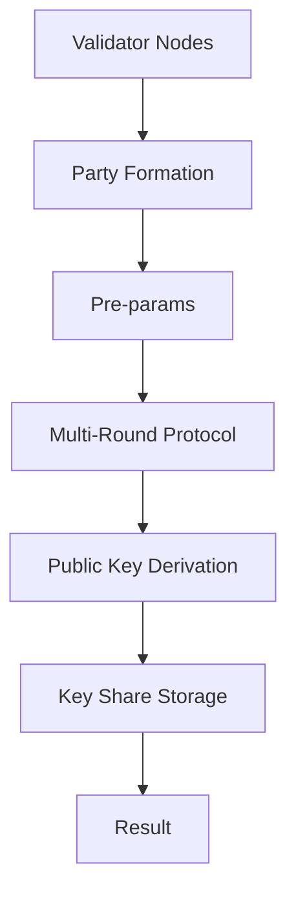
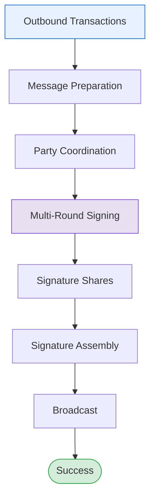
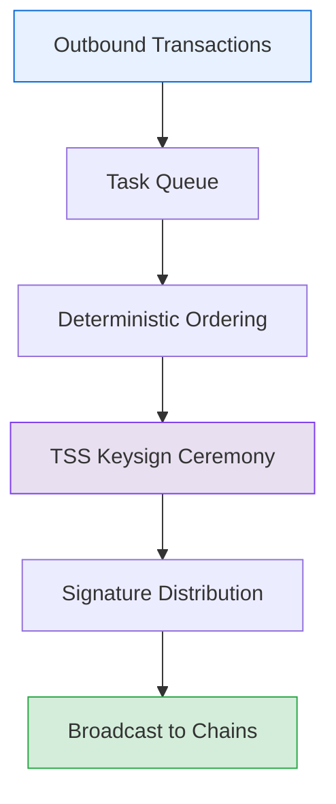
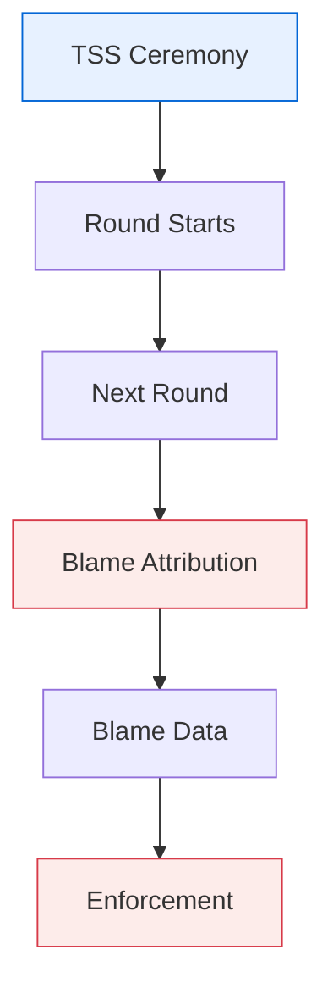

# TSS Implementation

THORChain's Threshold Signature Scheme (TSS) implementation provides the cryptographic foundation for secure multi-party vault management without trusted dealers or centralized key storage. This system enables validator nodes to collectively generate valid signatures for a shared vault public key through distributed secret shares, where the corresponding private key never exists in any physical or reconstructed form.

## Table of Contents

- [THORChain Implementation](#thorchain-implementation)
- [Key Generation (KeyGen)](#key-generation-keygen-process)
- [Message Signing (KeySign)](#message-signing-keysign-process)
- [Batch Signing Process](#batch-signing-process)
- [Blame Process](#blame-process)

## TSS Properties

- Threshold Security: Signatures require cooperation from at least `⌈n×2/3⌉` parties (a 2/3 supermajority)
- No Trusted Dealer - No single party controls the key generation; all participants contribute randomness
- Verifiable - Each participant can cryptographically verify others' contributions using zero-knowledge proofs
- No Complete Private Key - The full private key never exists anywhere, not even temporarily
- Non-Interactive Signing: The cryptographic protocol requires no trusted coordinator; all parties participate as equals
- Robustness: The protocol continues functioning even when up to `n/3` parties are offline or malicious
- Rotating Membership: TSS ceremonies support membership changes via churn
- Byzantine Fault Tolerance - The protocol identifies non-participating or faulty THORNodes

This is what makes THORChain's vault system secure - the vault's private key is mathematically "distributed" across multiple validators as secret shares, so no single entity can steal funds. A 2/3 supermajority of parties is required to spend funds from a TSS vault.

The TSS process is broken up into two main parts:

1. [Key Generation (KeyGen)](#key-generation-keygen-process): How validator nodes jointly create vault keys without any party knowing the complete private key
2. [Message Signing (KeySign)](#message-signing-keysign-process): How threshold participants sign transactions using secret shares without reconstructing the private key

For vault lifecycle and operational concepts, see [Vault Behaviors](vault-behaviors.md).

## THORChain Implementation

THORChain's TSS implementation uses the GG20 (Gennaro and Goldfeder 2020) protocol and is built on:

**go-tss Wrapper** ([`bifrost/tss/go-tss/`](https://gitlab.com/thorchain/thornode/-/tree/develop/bifrost/tss/go-tss))

- THORChain-specific integration layer
- Handles protocol lifecycle, message routing, state persistence
- Integrates with THORChain consensus and P2P network

**tss-lib** ([`gitlab.com/thorchain/tss/tss-lib`](https://gitlab.com/thorchain/tss/tss-lib))

- THORChain's fork of Binance's tss-lib, upgraded from GG18 to GG20
- Core cryptographic primitives and multi-party computation
- Implements GG20 protocol for ECDSA and EdDSA

## Key Generation (KeyGen) Process

The KeyGen process uses a cryptographic protocol that allows multiple parties (THORNodes) to jointly generate a shared public key and individual secret shares without any single party ever knowing or being able to reconstruct the complete private key. This creates a TSS vault where only the members who participated in the KeyGen ceremony can sign transactions. This TSS vault is an [Asgard vault](vault-behaviors.md) and is what holds funds for the protocol.

**Visual Flow**:

| Step       | Process                 | Details                                                                                                                          |
| ---------- | ----------------------- | -------------------------------------------------------------------------------------------------------------------------------- |
| **Input**  | Validator Nodes         | n participants in the TSS ceremony                                                                                               |
| **1**      | Party Formation         | Convert pubkeys to party IDs, calculate threshold `ceil(n*2/3)-1`, initialize P2P context                                        |
| **2**      | Pre-params (ECDSA only) | Generate safe primes, Paillier cryptosystem setup                                                                                |
| **3**      | Multi-Round Protocol    | Zero-knowledge proofs, encrypted share exchange, commitment verification, public key derivation, additional range proofs (ECDSA) |
| **4**      | Public Key Derivation   | All nodes compute the SAME public key without reconstructing the private key                                                     |
| **5**      | Key Share Storage       | Each node stores its encrypted secret share, the shared public key, and party metadata                                           |
| **Result** | Success                 | Same vault public key, different secret shares per node, no complete private key exists                                          |

## Message Signing (Keysign) Process

### Threshold Signing Overview

Threshold signing is the process where a subset of vault participants (meeting the 2/3+ threshold) collaboratively create valid cryptographic signatures using only their individual secret shares. The private key is never reconstructed during this process.

Each signing ceremony takes a constructed outbound transaction (like a Bitcoin or Ethereum transaction), coordinates the participating nodes, and produces a valid signature that appears identical to one created by a single private key. This signature can be verified by anyone using the vault's public key, but was created through distributed cooperation rather than by any single entity holding the complete private key.

Key characteristics of the keysign process:

1. [Batch Processing](#batch-signing-process) - Multiple transactions can be signed in a single ceremony (up to 15 messages)
2. Deterministic Output - All participants produce the same final signature through coordinated message ordering

### Keysign Implementation Flow

**Visual Flow**:

| Step       | Process               | Details                                                                                                                                                                                                    |
| ---------- | --------------------- | ---------------------------------------------------------------------------------------------------------------------------------------------------------------------------------------------------------- |
| **Input**  | Outbound Transactions | BTC, ETH, RUNE, etc (1-15 per batch)                                                                                                                                                                       |
| **1**      | Message Preparation   | Hash tx data: UTXO uses Double-SHA256, EVM uses Keccak256+EIP-155, Cosmos uses SHA256 of canonical JSON. Batch up to 15 messages.                                                                          |
| **2**      | Party Coordination    | Load vault party info from KeyGen, retrieve encrypted key shares, form signing party (2/3+ quorum required)                                                                                                |
| **3**      | Multi-Round Signing   | Round 1: Generate ephemeral keys/nonces. Round 2: Exchange commitments + partial sigs. Round 3: Combine shares → final (R,S). ECDSA adds range proofs. Messages sorted by hash for deterministic ordering. |
| **4**      | Signature Shares      | Each party computes partial signature using: secret share from KeyGen + message hash + ephemeral randomness                                                                                                |
| **5**      | Signature Assembly    | Aggregate (R,S) components, compute recovery ID (EVM), validate against public key                                                                                                                         |
| **6**      | Broadcast             | Signature returned to chain client, transaction broadcast to network                                                                                                                                       |
| **Result** | Success               | Valid ECDSA/EdDSA signature, no private key reconstructed, threshold cooperation only                                                                                                                      |

## Batch Signing Process

THORChain batches multiple transaction signatures into a single TSS signing ceremony for efficiency. This reduces the number of cryptographic ceremonies required and improves throughput.

**Visual Flow**:

| Step       | Process                | Details                                                                      |
| ---------- | ---------------------- | ---------------------------------------------------------------------------- |
| **Input**  | Outbound Transactions  | BTC Tx, ETH Tx, RUNE Tx, etc. from THORNode                                  |
| **1**      | Task Queue             | Accumulate messages per vault, enforce batch size limits, group by algorithm |
| **2**      | Deterministic Ordering | Sort messages by hash, all nodes use same order, critical for consensus      |
| **3**      | TSS Keysign Ceremony   | Multi-round protocol, threshold participation, generate signatures           |
| **4**      | Signature Distribution | Return signatures to chain clients, chain-specific formatting                |
| **Result** | Broadcast to Chains    | Bitcoin network, Ethereum network, other supported chains                    |

Messages are sorted deterministically to ensure all nodes produce identical signatures. The batch signing process groups messages by cryptographic algorithm (ECDSA or EdDSA).

Implementation: [`bifrost/tss/`](https://gitlab.com/thorchain/thornode/-/tree/develop/bifrost/tss)

## Blame Process

When a TSS ceremony fails, the system tracks which nodes participated successfully and which did not.

**Visual Flow**:

| Step       | Process           | Details                                                                                                                 |
| ---------- | ----------------- | ----------------------------------------------------------------------------------------------------------------------- |
| **Input**  | TSS Ceremony      | Keygen or Keysign ceremony begins                                                                                       |
| **1**      | Round Starts      | All nodes respond → Success, continue                                                                                   |
| **2**      | Next Round        | Node timeout/fail → Failure detected                                                                                    |
| **3**      | Blame Attribution | Identify last successful round, track non-responsive nodes, collect cryptographic proof, determine unicast vs broadcast |
| **4**      | Blame Data        | Failure reason, failed round, blamed node pubkeys, cryptographic signatures                                             |
| **Result** | Enforcement       | Report to THORChain consensus, validator slashing applied, node potentially jailed                                      |

### Blame Categories

The system categorizes different types of failures:

| Category           | Description                       |
| ------------------ | --------------------------------- |
| Hash Check Failure | Cryptographic verification failed |
| TSS Timeout        | Ceremony exceeded time limits     |
| Sync Failure       | Nodes failed to synchronize       |
| Message Corruption | Share verification failed         |
| Internal Error     | Party formation failed            |

## Implementation

The blame system is implemented in [`bifrost/tss/go-tss/blame/`](https://gitlab.com/thorchain/thornode/-/tree/develop/bifrost/tss/go-tss/blame).

Blame data includes failure reasons, failed rounds, blamed node public keys, and cryptographic proof. This data is used by THORChain to apply [slashing penalties](./vault-behaviors.md#slashing-mechanics).
Note that blame attribution cannot distinguish between malicious behavior and innocent failures.

## Related Documentation

- [Vault Behaviors](vault-behaviors.md) - Vault lifecycle and management
- [How Bifrost Works](how-bifrost-works.md) - Cross-chain bridge architecture
- [Chain Clients](../chain-clients/) - Blockchain-specific implementations
