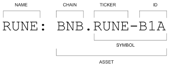

# Asset Notation

THORChain uses a CHAIN.ASSET notation for all assets. TICKER and ID are added where required. The asset full notation is pictured.

<p align="center">
  
</p>

Each asset type has a different delimiter, as explained below. Understanding this notation and delimiter is essential for interacting with THORChain, especially when constructing [transaction memos](./memos.md).

There are five kinds of assets within THORChain:

1. [Layer 1 Assets](asset-notation.md#layer-1-assets) - CHAIN.ASSET
1. [Synthetic Assets](asset-notation.md#synthetic-assets) - CHAIN/Asset
1. [Trade Assets](asset-notation.md#trade-assets) - CHAIN~ASSET
1. [Derived Assets](asset-notation.md#derived-assets) - THOR.ASSET
1. [Secured Assets](asset-notation.md#secured-assets) - CHAIN-ASSET

For a complete list of usable Layer 1 (L1) asset names and their shortcuts, refer to the [Shortened Asset Names](./memo-length-reduction.md) documentation. These shortcuts are particularly useful for constructing memos. To learn more about how asset notation is used within memos, visit the [Memo Documentation](./memos.md).

## Examples

| Asset         | Notation                                            |
| ------------- | --------------------------------------------------- |
| Bitcoin       | BTC.BTC (Native BTC)                                |
| Bitcoin       | BTC~BTC (Trade BTC)                                 |
| Bitcoin       | BTC-BTC (Secured BTC)                               |
| Bitcoin       | BTC/BTC (Synthetic BTC)                             |
| Bitcoin       | THOR.BTC (Derived BTC)                              |
| Ethereum      | ETH.ETH                                             |
| USDT          | ETH.USDT-0xdac17f958d2ee523a2206206994597c13d831ec7 |
| RUNE (NATIVE) | THOR.RUNE                                           |
| RUJI (NATIVE) | THOR.RUJI                                           |

## Layer 1 Assets

- Layer 1 (L1) chains are always denoted as `CHAIN.ASSET`, e.g. BTC.BTC.
- As two tokens can live on different blockchains, the chain can be used to distinguish them. Example: USDC is on the Ethereum Chain and Avalanche Chain and is denoted as `ETH.USDC` and `AVAX.USDC` respectively; note the contract address (ticker) was removed for simplicity.
- Tickers are added to denote assets and are required in the full name. For EVM based Chains, the ticker is the ERC20 Contract address, e.g. `ETH.USDC-0XA0B86991C6218B36C1D19D4A2E9EB0CE3606EB48`. This ensures the asset is specific to the contract address. The [pools list](https://gateway.liquify.com/chain/thorchain_midgard/v2/pools)shows assets using the full notation.

```admonish danger
THOR.RUNE is the only RUNE asset in use. All other RUNE assets on other chains are no longer in use and have no value within THORChain.
```

## Synthetic Assets

- [Synthetic Assets](https://docs.thorchain.org/thorchain-finance/synthetic-asset-model) are denoted as `CHAIN/ASSET` instead of `CHAIN.ASSET`, e.g. Synthetic BTC is `BTC/BTC` and Synthetic USDT is `ETH/USDT.` While Synthetic assets live on the THORChain blockchain, they retain their CHAIN identifier.
- Synthetic Assets can only be created from THORChain-supported L1 assets and are only denoted as `CHAIN/ASSET`, no ticker or ID is required.
- Chain differentiation is also used for Synthetics, e.g. `ETH/USDC` and `AVAX/USDC` are different Synthetic assets created and redeemable on different chains.

## Trade Assets

- Trade Assets are held within a Trade Account and are created from Layer1 assets, denoted as `CHAIN~ASSET`. The Bitcoin trading asset is `BTC~BTC`.
- Unlike synths which are minted as coins in the Cosmos bank module, trade asset balances are recorded in a custom keeper and cannot be transfer from one native address to another.

## Derived Assets

- Derived Assets, currently specific to Lending, are denoted as `THOR.ASSET.` E.g. `THOR.BTC` is Derived Bitcoin.
- All Derived Assets live on the THORChain blockchain and do not have a Chain identifier.
- Currently, Derived Assets are used internally within THORChain only.

## Secured Assets

- Secured Assets are accounted by the Cosmos SDK x/bank module, and are created from Layer1 assets, denoted as `CHAIN-ASSET`. The Bitcoin secured asset is `BTC-BTC`.
- They are fungible and transferrable via a regular MsgSend, can be sent over IBC, and integrate with CosmWasm smart contracts
- Each Secured Asset maintains a balance of the total underlying L1 tokens deposited. The x/bank native token is therefore a share token, representing an ownership of the Asset Pool (as a fraction of the total supply of the share token)
